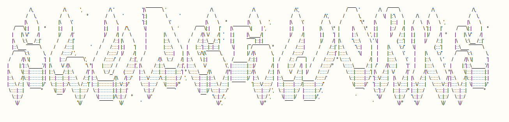

The worlds greatest oddity has long been the SludgeWorks; a reality-warping cave network that stabs deep into the heart of the earth. Here, some alien force has caused evolution and natural selection to go into overdrive, causing the native flora and fauna to mutate beyond all plausibility. This rift contains great treasures and although many attempts have been made to exploit this unknown realm, only whispers of its powers reach the surface. Mutated and feral, vaguely-human remnants of previous expeditions wander it's twisted caverns, shying away from the light and adapting to their wretched forms. Despite these perils, the prospect of eternal life and evolutionary transcendence are rumoured to await those brave enough to reach the Mezzanine, the fabled final chamber, and bathe in its ichor.

Can you survive the onslaught of the Cleansing Hand's pious bastion? Will the vampyric remnants of the Kyvan Company prevent your descent into the Screaming Ruins? Is it possible to enter the Cult of Eternity's palace of hedonism without being kidnapped? 

Will you torch all foliage in your path, or become a living vessel for nature's experiments?

Are you dumb enough to impale a Bloodseeker?

Welcome to the SludgeWorks; adapt or be adapted.

# Implemented
- Biome: Hypogean Caves
- Biome: Broken Halls
- D&D Diceroll combat, including critical hits & armour penetration
- Adaptive stat attributes
- Auto-explore

# TODO
- Look menu
- Mutations
- Purity factor (how mutated is your character?)
- Character-stat UI
- Message Log menu
- Scrolling menus
- Character creation & Prepare Carefully screen
- Quick New Game
- DoT Effects (bleed, poison)
- Biome: Screaming Ruins
- Chamber: Cleansing Hand Bastion
- Chamber: Palace of Hedonism
- Passive Ability: Regeneration
